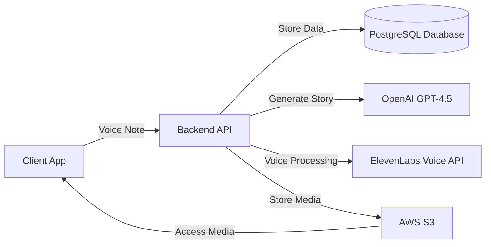

# DramaCraft

*Micro-drama studio that turns your voice notes into viral short stories*

DramaCraft is a mobile application designed to transform 30-second user-recorded voice notes into engaging visual micro-dramas using AI technology. Targeting content creators in the rapidly growing micro-drama market, DramaCraft provides a platform for testing story concepts with minimal investment, leveraging AI for character creation, scene setting, and cliffhanger optimization.

## Features

- Voice-to-drama AI generator
- Character consistency engine
- Cliffhanger optimizer
- Cross-platform sharing

## Tech Stack

**Frontend**
- React Native 0.72
- Redux 8.0
- React Navigation 6.0

**Backend**
- Node.js 18.x
- Express.js 4.18

**Database**
- PostgreSQL 14.x

**Infrastructure**
- AWS S3
- AWS Lambda
- AWS Elastic Beanstalk
- AWS RDS for PostgreSQL
- OpenAI GPT-4.5 API
- ElevenLabs Voice API

## Architecture

DramaCraft is architected to efficiently convert voice notes into visual stories, integrating multiple services to achieve this. The frontend is built with React Native for cross-platform accessibility, while the backend handles AI processing and data management.



## Project Structure

```plaintext
DramaCraft/
│
├── frontend/
│   ├── src/
│   │   ├── components/
│   │   │   ├── Recorder.js
│   │   ├── screens/
│   │   │   ├── HomeScreen.js
│   │   │   ├── StoryScreen.js
│   │   ├── redux/
│   │   │   ├── reducers/
│   │   │   └── store.js
│   ├── package.json
│   └── .env.example
│
└── backend/
    ├── src/
    │   ├── controllers/
    │   │   ├── userController.js
    │   │   ├── storyController.js
    │   ├── routes/
    │   │   ├── userRoutes.js
    │   │   ├── storyRoutes.js
    │   ├── models/
    │   │   ├── User.js
    │   │   ├── Story.js
    │   ├── services/
    │   │   ├── storyService.js
    │   ├── utils/
    │   │   ├── database.js
    │   ├── app.js
    ├── config/
    │   ├── db.js
    ├── package.json
    └── .env.example
```

## Getting Started

### Prerequisites

- Node.js 18.x
- PostgreSQL 14.x
- AWS Account

### Installation

1. Clone the repository:
   ```bash
   git clone https://github.com/yourusername/dramacraft.git
   cd dramacraft
   ```

2. Install dependencies for both frontend and backend:
   ```bash
   cd frontend
   npm install
   cd ../backend
   npm install
   ```

### Environment Variables

Copy the `.env.example` files in both `frontend` and `backend` directories to `.env` and fill in the required credentials:

- OpenAI API Key
- ElevenLabs API Key
- AWS Credentials
- Database Connection URI

### Running

1. Start the backend server:
   ```bash
   cd backend
   npm start
   ```

2. Start the frontend application:
   ```bash
   cd frontend
   npm start
   ```

## Documentation

- [Product Requirements](docs/PRD.md)
- [Design Brief](docs/DESIGN.md)
- [Architecture](docs/ARCHITECTURE.md)

## License

This project is licensed under the MIT License.